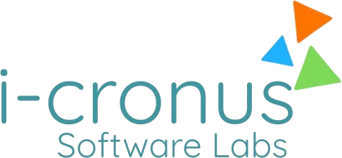

# i-Cronus: Enterprise Command Platform

 <!-- Update image path if needed -->

Welcome to the **i-Cronus Enterprise Command Platform** repository. This is a highly engineered, deterministic web platform built to serve as the global digital headquarters for i-Cronus Software Labs, communicating our authority in AI, Data, and Cloud Infrastructure.

## 🚀 Advanced Features

* **Global Command Network Visualization:** Features an interactive WebGL data globe built with React Three Fiber (`EnterpriseCommandNetwork.tsx`) that visualizes global node infrastructure, active failovers, and autonomous agent routing.
* **Premium Enterprise Aesthetics:** Eschews heavy animations and gradient overload for a crisp, Palantir/Stripe-tier dark mode layout emphasizing high information density, deep spatial storytelling, and stark contrasts.
* **Global Operations Delivery Map:** Replaces standard location maps with a custom-styled, interactive MapLibre GL global delivery map (`EnterpriseMap.tsx`), highlighting the India Node (HQ), APAC presence, Europe coverage, and North America operations.
* **Intelligent Routing & Theming:** Utilizes a custom Next.js App Router setup with dynamic magnetic routing (`Magnetic.tsx`), smooth scroll physics, and optimized layout shifting.
* **Engineered Branding:** Custom SVG-based geometry for the i-Cronus logo and dynamic favicons (`icon.tsx`) ensuring mathematically precise alignment and scaling across all device resolutions.

## 🛠 Tech Stack

* **Framework:** [Next.js 15 (App Router)](https://nextjs.org/)
* **Library:** [React 19](https://react.dev/)
* **Styling:** [Tailwind CSS v3](https://tailwindcss.com/)
* **Animations:** [Framer Motion](https://www.framer.com/motion/)
* **WebGL / 3D:** [Three.js](https://threejs.org/) & [@react-three/fiber](https://docs.pmnd.rs/react-three-fiber/getting-started/introduction)
* **Maps:** [MapLibre GL JS](https://maplibre.org/) & `react-map-gl`
* **Icons:** [Lucide React](https://lucide.dev/)
* **Tooling:** TypeScript, ESLint, PostCSS

## 📦 Getting Started

### 1. Installation

Ensure you have Node.js 18.x or later installed.

```bash
# Clone the repository
git clone https://github.com/Hemanth-0629/I-Cronus.git
cd i-cronus

# Install dependencies
npm install
```

### 2. Environment Variables

Create a `.env.local` file in the root of the project to enable advanced features like custom map styling.

```env
# Optional: Mapbox Token for premium dark-v11 styling. 
# Falls back to Carto Dark Matter if omitted.
NEXT_PUBLIC_MAPBOX_TOKEN=your_mapbox_token_here
```

### 3. Running the Development Server

```bash
npm run dev
```

Open [http://localhost:3000](http://localhost:3000) with your browser to see the platform.

### 4. Production Build

To build the application for production deployment:

```bash
npm run build
npm run start
```

## 🏗 Architecture & Codebase Structure

* `src/app/`: Next.js App Router pages (`/`, `/contact`, `/services`, etc.).
* `src/components/canvas/`: WebGL, Three.js, and React Three Fiber 3D environments.
* `src/components/sections/`: Primary modular landing page components (Hero, TechExpertise, etc.).
* `src/components/global/`: Global layout components (Navbar, Footer).
* `src/components/ui/`: Micro-interactions, vectors, buttons, and animations (Logo, Magnetic).
* `src/components/contact/`: MapLibre and location-specific components.
* `src/store/`: Zustand state management for WebGL and visual state transitions.

## 🔒 License & Ownership

Copyright © i-Cronus Software Labs. All rights reserved. 
Protected by strict NDA. Internal use only unless authorized.
